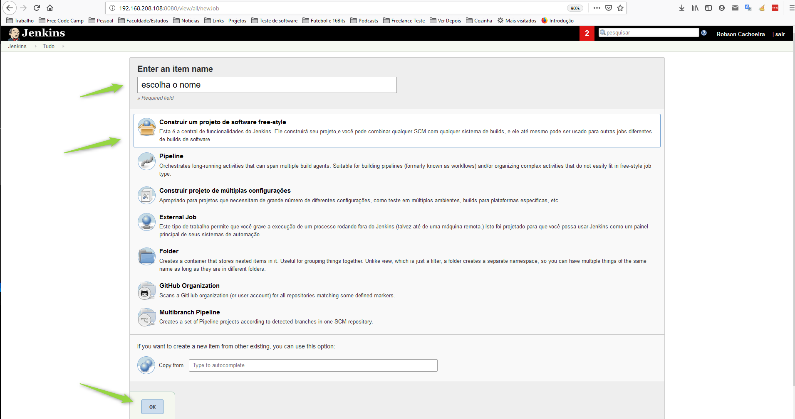
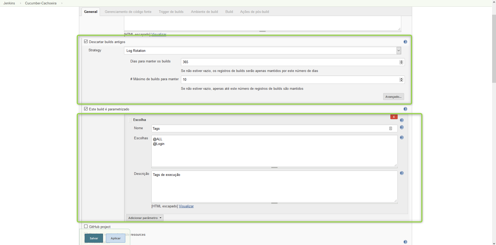
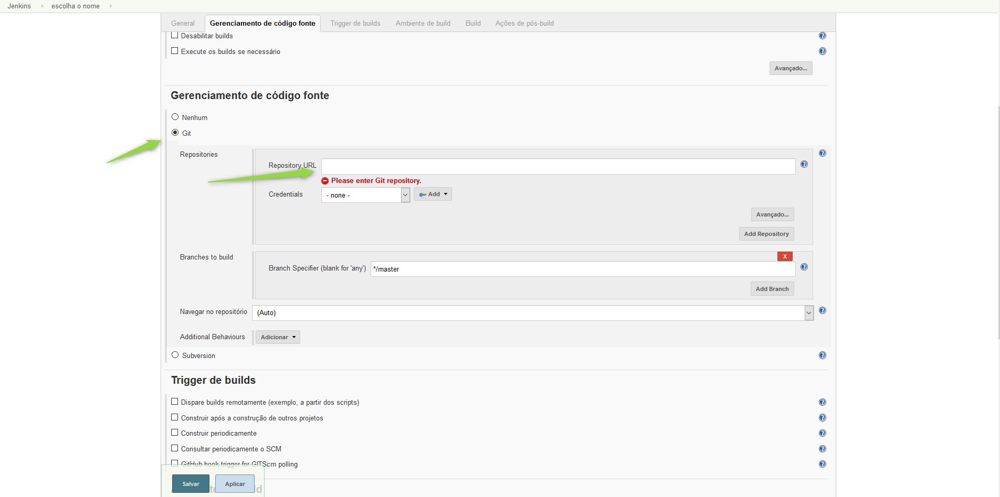
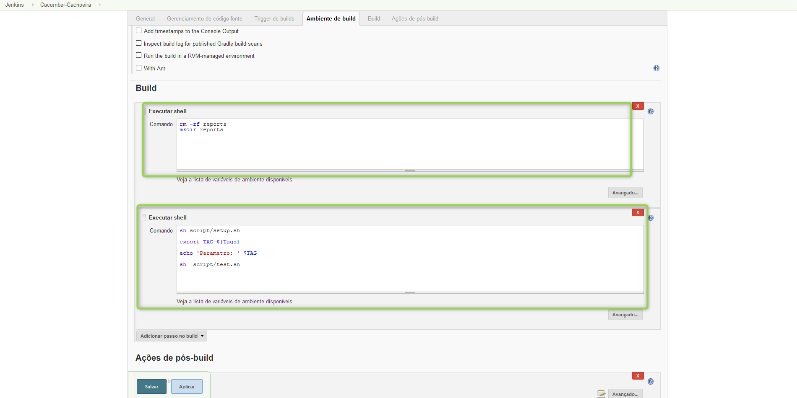
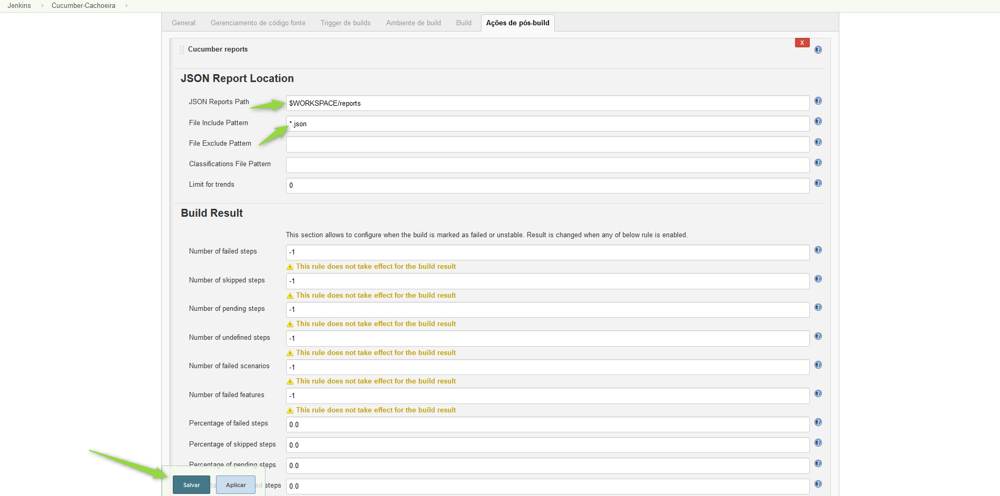
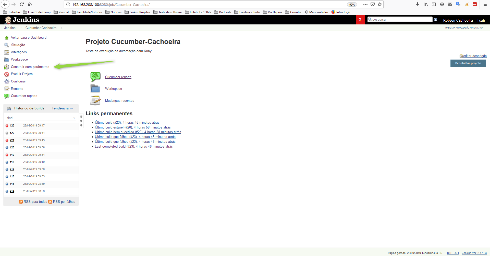
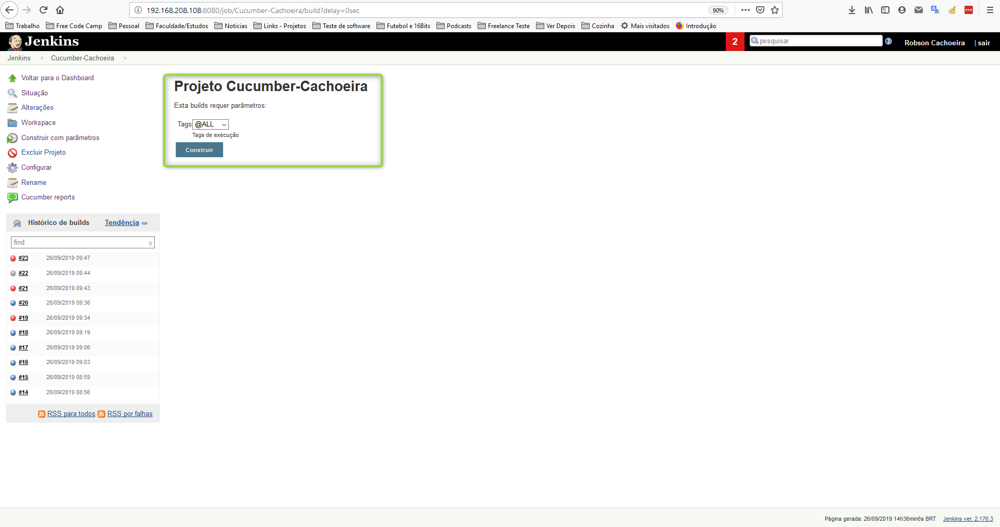
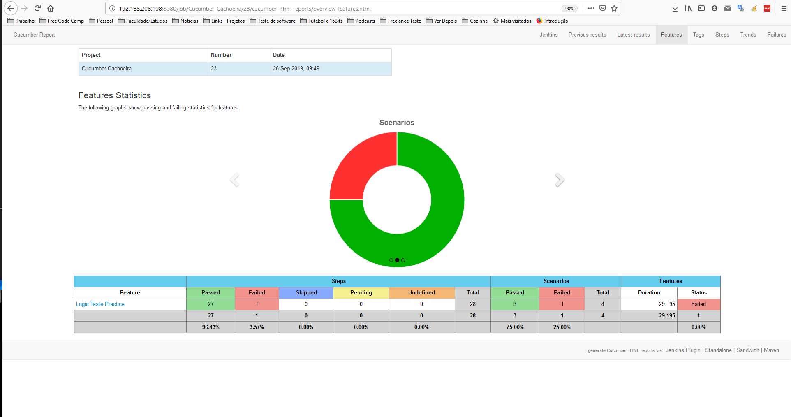

# README #

Projeto de exemplo com configurações iniciais.

### O que há neste repositório? ###

Projeto padrão cucumber capybara.

### Como fazer para iniciar e executar na sua maquina? ###
Tenha o Ruby instalado na sua maquina.
Clone esse projeto.
Após isso acesse a pasta example_cucumber_capybara e execute o comando:
```
bundle install
```
Este comando irá instalar todas as dependencias do projeto, que estão definidas no arquivo Gemfile na raiz do projeto.

Agora para ser possível executar os testes do projeto dentro da pasta example_cucumber_capybara execute o comando:
```
Cucumber
```

### Como rodar estes testes no Jenkins com integração continua? ###

Em seu servidor Jenkins clique em *Novo Job* 


Escolha um nome para seu JOB.
Selecione a opção de criação de projeto estilo livre.
Clique em OK.


Primeiro configure para guardar apenas os ultimos 10 Builds do ultimo ano(depende do que você julgar necessário)

Segundo Configure um parametro chamado TAG com as opções que julgar necessário, este parametro será passado e utilizado na execução como um -t do cucumber fazendo com que apenas os testes que tenham a TAG selecionada seja executado, ajudando assim para quese possa executar menos testes em alguns momentos.

Obs.: Para testes que executam automaticamente em uma hora redeterminada o parametro utilizado será o primeiro da lista.


Selecione a opção GIT e informe a URL do projeto de testes.


Insira dois passos de builds.
O primeiro com os comandos:
```
rm -rf reports
mkdir reports
```
Que irão remover a pasta reports se existir e recia-la vazia, isso é apenas para garantir que não tenhamos sujeira de execuções anteriores.

O segundo com os comandos:
```
sh script/setup.sh

export TAG=${Tags}

echo 'Parametro: ' $TAG

sh  script/test.sh
```
Estes comandos executam os scripts que vem no projeto, criando as imagens Docker e subindo os containers necessários para a execução dos testes, bem como parando os mesmos e eliminando ao fim dos testes, não deixando o servidor ficar cheio de coisa desnecessária.


Insira um passo de POsBuild chamado de Cucumber Reports (Esse plugion deve estar instalado no Jenkins em questão).
Informe de qual pasta ele deve buscar o relatório.
E após isso clique em salvar.

*E PARA EXECUTAR*


Entre no JOB do Jenkins que acabou de ser criado.
e clique em Construir com parâmetros


Selecione uma parâmetro e clique em Construir.

Pronto ja estará executando e você verá quando terminar, ao clicar no cucumber Reports dentro do JOB após a execução você poderá ver o resultado como na imagem baixo:


